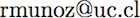

# Tópicos de especialización 1

Ingeniería Civil Industrial
Universidad Central

**Profesor**:  Roberto Muñoz
**E-mail**:  
**Sala**: Edificio VK1, Sala 506

El curso "Tópicos de especialización 1" forma parte de la malla curricular de Ingenieria Civil Industrial del programa de Prosecución de estudios. Las clases serán presenciales y serán dividas entre clases teóricas y talleres de análisis estadístico.

Las evaluaciones consistirán de dos pruebas (20% cada una), un proyecto final del curso (30%) y talleres de análisis estadístico que ser harán todas las clases (30%).

## Evaluaciones

- **Prueba 1**
  Fecha:  10/07/2017
  Ponderación: 20%

- **Prueba 2**
  Fecha: 7/08/2017
  Ponderación: 20%

- **Proyecto**
  Fecha inicio: 14/08/2017
  Fecha término: 28/08/2017
  Ponderación: 30%

- **Talleres de programación**
  Fecha: Todas las clases
  Ponderación: 30%
