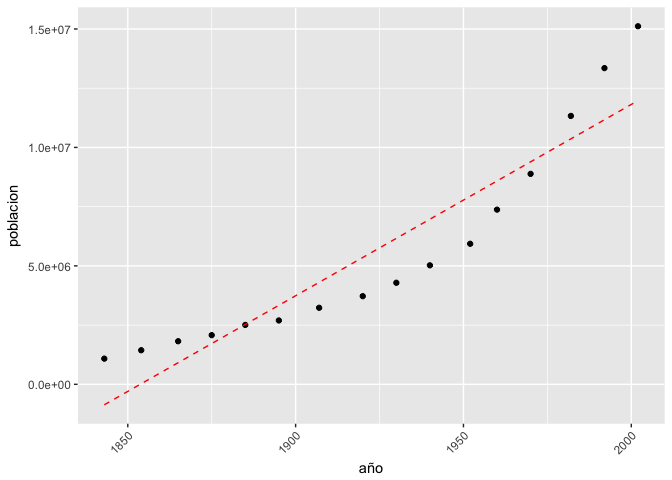
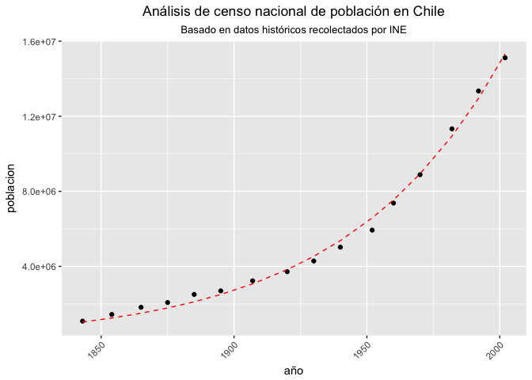

Construcción de modelos lineales y no lineales
================
Roberto Muñoz
01 August, 2017

-   [Ajustamos el locale del sistema de acuerdo al OS del computador](#ajustamos-el-locale-del-sistema-de-acuerdo-al-os-del-computador)
-   [Cargamos las librerías que usaremos en el script](#cargamos-las-librerias-que-usaremos-en-el-script)
-   [Descargar datos y hacer una visualización simple](#descargar-datos-y-hacer-una-visualizacion-simple)
-   [Construcción de modelos lineales y no lineales en R](#construccion-de-modelos-lineales-y-no-lineales-en-r)
    -   [MODELO LINEAL - Polinomios](#modelo-lineal---polinomios)
    -   [MODELO LINEAL - Splines](#modelo-lineal---splines)
    -   [MODELO NO LINEAL](#modelo-no-lineal)

Ajustamos el locale del sistema de acuerdo al OS del computador
===============================================================

En caso de usar un Mac ejecute la siguiente linea

``` r
Sys.setlocale("LC_ALL", 'en_US.UTF-8')
```

    ## [1] "en_US.UTF-8/en_US.UTF-8/en_US.UTF-8/C/en_US.UTF-8/en_US.UTF-8"

En caso de usar Windows ejecute la siguiente linea

``` r
Sys.setlocale("LC_ALL", 'Spanish_Chile.1252')
```

    ## Warning in Sys.setlocale("LC_ALL", "Spanish_Chile.1252"): OS reports
    ## request to set locale to "Spanish_Chile.1252" cannot be honored

    ## [1] ""

Cargamos las librerías que usaremos en el script
================================================

``` r
library(dplyr)
```

    ## 
    ## Attaching package: 'dplyr'

    ## The following objects are masked from 'package:stats':
    ## 
    ##     filter, lag

    ## The following objects are masked from 'package:base':
    ## 
    ##     intersect, setdiff, setequal, union

``` r
library(ggplot2)
```

Descargar datos y hacer una visualización simple
================================================

``` r
url = "https://raw.githubusercontent.com/rpmunoz/topicos_ingenieria_1/master/clase_7/data/censo_chile.csv"
censo = read.csv(url, fileEncoding="UTF-8")
head(censo)
```

    ##    año poblacion
    ## 1 1843   1083701
    ## 2 1854   1439120
    ## 3 1865   1819223
    ## 4 1875   2075971
    ## 5 1885   2507005
    ## 6 1895   2695625

Hacemos un gráfico de puntos para visualizar los datos

``` r
plot1 <- ggplot(censo, aes(x=año, y=poblacion)) +
  geom_point() +
  theme(axis.text.x = element_text(angle=45, hjust=1))
plot1
```


Construcción de modelos lineales y no lineales en R
===================================================

El lenguaje R permite construir modelos matemáticos tanto lineales como no lineales.

MODELO LINEAL - Polinomios
--------------------------

En general, los modelos lineales son los más fáciles de entender y modelar. En R se emplea la función lm() para construir modelos lineales.

Para obtener ayuda acerca de la función lm ejecutamos `help(lm)`

Partimos usando un modelo lineal simple para entender cómo la población del país cambia a lo largo de la historia

``` r
lmfit <- lm(poblacion ~ año, data=censo)
```

Usamos la función `summary()` para ver los resultados de la regresión lineal

``` r
summary(lmfit)
```

    ## 
    ## Call:
    ## lm(formula = poblacion ~ año, data = censo)
    ## 
    ## Residuals:
    ##      Min       1Q   Median       3Q      Max 
    ## -2005820 -1316641  -264196  1079796  3139391 
    ## 
    ## Coefficients:
    ##               Estimate Std. Error t value Pr(>|t|)    
    ## (Intercept) -149713644   16470886  -9.090 3.01e-07 ***
    ## año              80765       8561   9.434 1.91e-07 ***
    ## ---
    ## Signif. codes:  0 '***' 0.001 '**' 0.01 '*' 0.05 '.' 0.1 ' ' 1
    ## 
    ## Residual standard error: 1681000 on 14 degrees of freedom
    ## Multiple R-squared:  0.8641, Adjusted R-squared:  0.8544 
    ## F-statistic: 88.99 on 1 and 14 DF,  p-value: 1.914e-07

Usamos el modelo lineal que acabamos de construir y creamos la columna poblacion.predict para almacenar los valores predichos por le modelo

``` r
censo$poblacion.predict <- predict(lmfit, newdata=censo)
```

Graficamos los datos originales y el modelo lineal

``` r
plot1 + geom_line(data=censo, aes(x=año, y=poblacion.predict), linetype="dashed", color="red")
```



Podemos ver que el Multiple R-squared es 0.86, lo cual indica que el modelo es bueno pero quizás no es el más óptimo

El `p-value` es mucho menor que 0.05, por lo cual podemos rechazar la hipotesis nula que no existe correlación (=0)

De esta manera, podemos concluir que existe una relación significativa entre las variables de acuerdo al modelo lineal

El Adjusted R-squared toma en cuenta el hecho de agregar más variables al modelo y que el valor de R-squared mejor por simple chance. Se usa el factor (N-1)/(N-k-1) donde -N = Número de observaciones -k = Número de variables

¿Que tal si construimos un modelo usando un polinomio de grado 2?

``` r
lmfit <- lm(poblacion ~ poly(año,2), data=censo)
summary(lmfit)
```

    ## 
    ## Call:
    ## lm(formula = poblacion ~ poly(año, 2), data = censo)
    ## 
    ## Residuals:
    ##     Min      1Q  Median      3Q     Max 
    ## -909284 -404047  124384  455001  681001 
    ## 
    ## Coefficients:
    ##               Estimate Std. Error t value Pr(>|t|)    
    ## (Intercept)    5616834     136233   41.23 3.63e-15 ***
    ## poly(año, 2)1 15859704     544933   29.10 3.20e-13 ***
    ## poly(año, 2)2  5975675     544933   10.97 6.11e-08 ***
    ## ---
    ## Signif. codes:  0 '***' 0.001 '**' 0.01 '*' 0.05 '.' 0.1 ' ' 1
    ## 
    ## Residual standard error: 544900 on 13 degrees of freedom
    ## Multiple R-squared:  0.9867, Adjusted R-squared:  0.9847 
    ## F-statistic: 483.6 on 2 and 13 DF,  p-value: 6.264e-13

El valor de R^2 mejora notablemente respecto a usar un polinomio de grado 1. Procedemos a visualizar el resultado.

``` r
censo$poblacion.predict <- predict(lmfit, newdata=censo)
plot1 + geom_line(data=censo, aes(x=año, y=poblacion.predict), linetype="dashed", color="red")
```


Podemos notar que modelo en general es bueno, pero todavía presenta un *residual standard error* alto.

MODELO LINEAL - Splines
-----------------------

``` r
library(splines)
```

Las splines son curvas diferenciables definidas en proporciones mediante polinomios. Para el ajuste de curvas, los splines se utilizan para aproximar formas complicadas.

Usaremos la función `bs()`, la cual permite generar una matriz de funciones bases del tipo B-splines. El parámetro `df=` corresponde a los grados de libertad. Más info <https://es.wikipedia.org/wiki/B-spline>

``` r
lmfit <- lm(poblacion ~ bs(año, df=3), data=censo)
summary(lmfit)
```

    ## 
    ## Call:
    ## lm(formula = poblacion ~ bs(año, df = 3), data = censo)
    ## 
    ## Residuals:
    ##     Min      1Q  Median      3Q     Max 
    ## -426555  -60999   -5219   93159  397993 
    ## 
    ## Coefficients:
    ##                  Estimate Std. Error t value Pr(>|t|)    
    ## (Intercept)       1091032     190699   5.721 9.59e-05 ***
    ## bs(año, df = 3)1  2206804     565919   3.900  0.00211 ** 
    ## bs(año, df = 3)2   389730     391346   0.996  0.33897    
    ## bs(año, df = 3)3 14423715     284759  50.652 2.30e-15 ***
    ## ---
    ## Signif. codes:  0 '***' 0.001 '**' 0.01 '*' 0.05 '.' 0.1 ' ' 1
    ## 
    ## Residual standard error: 234500 on 12 degrees of freedom
    ## Multiple R-squared:  0.9977, Adjusted R-squared:  0.9972 
    ## F-statistic:  1761 on 3 and 12 DF,  p-value: 3.967e-16

Podemos notar que el modelo construido usando splines de grado 3 es mucho mejor que un polinomio de orden 3

``` r
censo$poblacion.predict <- predict(lmfit, newdata=censo)
plot1 + geom_line(data=censo, aes(x=año, y=poblacion.predict), linetype="dashed", color="red")
```


Las splines suelen usarse para determinar valores de las variables dependientes (Y) dentro del rango de las variables idenpendientes (X). Suelen diverger y tener una gran varianza en los extermos del rango de X.

MODELO NO LINEAL
----------------

``` r
library(car)
```

    ## 
    ## Attaching package: 'car'

    ## The following object is masked from 'package:dplyr':
    ## 
    ##     recode

A diferencia de los modelos lineales, la mayoría de los modelos no lineales requieren especificar valores inciales para los parámetros del modelo. En caso de querer ver documentación de nls ver `help(nls)`

Partimos usando un polinomio de grado 2 como ecuación de la función `nls()`. Los tres argumentos más importantes son la ecuación, los valores iniciales y el dataframe

``` r
mfit <- nls(poblacion ~ theta1 + theta2*año + theta3*año^2, start=list(theta1=5e6, theta2=15e6, theta3=5e6), data=censo)
summary(mfit)
```

    ## 
    ## Formula: poblacion ~ theta1 + theta2 * año + theta3 * año^2
    ## 
    ## Parameters:
    ##          Estimate Std. Error t value Pr(>|t|)    
    ## theta1  2.464e+09  2.384e+08   10.34 1.23e-07 ***
    ## theta2 -2.640e+06  2.481e+05  -10.64 8.72e-08 ***
    ## theta3  7.075e+02  6.452e+01   10.97 6.11e-08 ***
    ## ---
    ## Signif. codes:  0 '***' 0.001 '**' 0.01 '*' 0.05 '.' 0.1 ' ' 1
    ## 
    ## Residual standard error: 544900 on 13 degrees of freedom
    ## 
    ## Number of iterations to convergence: 2 
    ## Achieved convergence tolerance: 2.972e-06

``` r
censo$poblacion.predict <- predict(mfit, newdata=censo)
plot1 + geom_line(data=censo, aes(x=año, y=poblacion.predict), linetype="dashed", color="red")
```


Un modelo ampliamente usado para estudiar el crecimiento de poblaciones en ecología corresponde al modelo de crecimiento logístico Más info <https://en.wikipedia.org/wiki/Logistic_function>

$Y = \\frac{\\theta\_1}{(1 + \\exp(-(\\theta\_2 + \\theta\_3 X))}$

En esta ecuación theta1 se le llama la asíntota, pues es el valor al cual tiende el modelo cuando el año tiende a infinito. Usaremos el valor máximo de la población para definir el valor inicial de theta1

``` r
theta1.start=10*max(censo$poblacion)
```

Para determinar valores iniciales de los otros dos parámetros, una manera es despejando los valores de theta1 hacia la izquierda y dejando solamente theta2 y theta3 a la derecha.

Ecuación despejada $\\log( \\frac{Y/\\theta\_1}{(1-Y/\\theta\_1)} ) = \\theta\_2 + \\theta\_3 X$

``` r
lmfit <- lm(logit(poblacion/theta1.start) ~ año, censo)
theta2.start=coef(lmfit)[1]
theta3.start=coef(lmfit)[2]
```

Llamamos a la función `nls()` para ajustar el modelo no lineal basado en los datos del censo histórico de Chile. Usamos el algoritmo `port` y definimos el rango de valores de los parámetros usando `lower=` y `upper=`.

``` r
mfit <- nls(poblacion ~ theta1/(1 + exp(-(theta2 + theta3*año))), start=list(theta1=theta1.start, theta2=theta2.start, theta3=theta3.start), data=censo, control = list(maxiter = 100), algorithm="port", lower=c(theta1.start/10,-Inf,-Inf), upper=c(theta1.start*10.,Inf, Inf))
summary(mfit)
```

    ## 
    ## Formula: poblacion ~ theta1/(1 + exp(-(theta2 + theta3 * año)))
    ## 
    ## Parameters:
    ##          Estimate Std. Error t value Pr(>|t|)    
    ## theta1  1.512e+09  2.478e+10   0.061   0.9523    
    ## theta2 -3.865e+01  1.365e+01  -2.831   0.0142 *  
    ## theta3  1.701e-02  1.526e-03  11.149 5.02e-08 ***
    ## ---
    ## Signif. codes:  0 '***' 0.001 '**' 0.01 '*' 0.05 '.' 0.1 ' ' 1
    ## 
    ## Residual standard error: 333900 on 13 degrees of freedom
    ## 
    ## Algorithm "port", convergence message: relative convergence (4)

Visualizamos el resultado del ajuste no lineal usando el modelo de regresión logística.

``` r
censo$poblacion.predict <- predict(mfit, newdata=censo)
plot1 +
  geom_line(data=censo, aes(x=año, y=poblacion.predict), linetype="dashed", color="red") +
  ggtitle("Análisis de censo nacional de población en Chile", subtitle="Basado en datos históricos recolectados por INE") +
  theme(plot.title = element_text(hjust = 0.5), plot.subtitle = element_text(hjust = 0.5))
```


